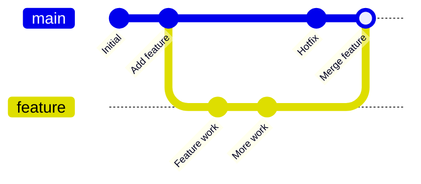

# git_wksp_26su

Tech GC

## Part1
[Part1 Repo](https://github.com/Tech-JI/Git-wksp-25Fa)

## To Do List

- [x] Organize workshop structure based on the framework
- [ ] Refine and improve content for each section
- [ ] Beautify interface (formatting, layout, visual elements)
- [ ] Add practice exercises to the `Exercise/` folder
- [ ] Add relevant images and diagrams
- [ ] Complete "How to Compile" documentation
- [ ] Review and supplement command examples
- [ ] Add more practical scenarios and use cases
- [ ] Include lazygit shortcuts reference
- [ ] Verify all code examples and commands

## How to Compile

This workshop uses **Pandoc** with **LaTeX** (xelatex) as the PDF engine to convert Markdown files into beautifully formatted PDFs.

### Prerequisites

You'll need the following tools installed on your system:

#### 1. Pandoc

Pandoc is a universal document converter that transforms Markdown to PDF.

**macOS:**
```bash
brew install pandoc
```

**Ubuntu/Debian:**
```bash
sudo apt-get update
sudo apt-get install pandoc
```

**Windows:**
Download the installer from [pandoc.org](https://pandoc.org/installing.html) or use Chocolatey:
```bash
choco install pandoc
```

#### 2. xelatex (TeX Live)

xelatex is a TeX engine that handles Unicode and supports system fonts.

**macOS:**
```bash
brew install texlive
```
Or install MacTeX (full distribution):
```bash
brew install --cask mactex
```

**Ubuntu/Debian:**
```bash
sudo apt-get update
sudo apt-get install texlive-xetex
```
For full LaTeX support:
```bash
sudo apt-get install texlive-full
```

**Windows:**
Install TeX Live from [tug.org/texlive](https://www.tug.org/texlive/) or use Chocolatey:
```bash
choco install texlive
```

#### 3. mermaid-filter (Optional)

mermaid-filter renders [Mermaid](https://mermaid.js.org/) diagrams in Markdown files as images.

**Install via npm:**
```bash
npm install -g mermaid-filter
```

**Alternative installation:**
```bash
pip install pandoc-mermaid-filter
```

### Building the PDFs

Once all prerequisites are installed, use the provided Makefile:

#### Build all PDFs:
```bash
make
```

#### Build specific PDF:
```bash
make part2.pdf
```

#### Clean generated PDFs:
```bash
make clean
```

#### Show available targets:
```bash
make help
```

### Manual Compilation

If you prefer to run pandoc directly:

**For Beamer presentations (part2.md):**
```bash
pandoc part2.md \
  --pdf-engine=xelatex \
  -t beamer \
  -F mermaid-filter \
  --slide-level=2 \
  --toc-depth=1 \
  --listing \
  -o part2.pdf
```

**For regular PDFs:**
```bash
pandoc README.md \
  --pdf-engine=xelatex \
  --highlight-style=tango \
  -V colorlinks=true \
  -V linkcolor=blue \
  -V urlcolor=blue \
  -o README.pdf
```

### Troubleshooting

**Issue: "xelatex not found"**
- Ensure TeX Live/xelatex is installed and added to PATH
- Restart terminal after installation

**Issue: "mermaid-filter not working"**
- Ensure npm is installed
- Try: `npm install -g mermaid-filter`
- Verify installation: `which mermaid-filter`

**Issue: "PDF generation fails"**
- Check that all prerequisites are installed
- Ensure you have sufficient disk space
- Try updating pandoc: `brew upgrade pandoc` (macOS)

### Verification

Verify your installation:
```bash
pandoc --version
xelatex --version
mermaid-filter --version  # if installed
```

## Purpose

Part 1 introduces Git basics: shell usage, setup, repositories, staging, commits, simple undo commands, basic branches, remotes, merge conflict resolution, and common beginner issues.

Part 2 should assume students can already clone a repository, make commits, create branches, push and pull, and resolve a simple conflict. The goal is to help students work confidently in realistic team workflows where history is non-linear, mistakes happen, and branches need to be cleaned up before sharing.

## Short Summary

The core topics are merge strategy, practical rebase workflows, interactive rebase, cherry-pick, reflog recovery, lazygit, fork/PR workflow, and GitHub Actions.
## Proposed Audience Assumptions

Students should already know:

- `git clone`, `git status`, `git add`, `git commit`, `git diff`, `git log`
- `git branch`, `git checkout` or `git switch`
- Basic `git merge` and `git rebase`
- `git push`, `git pull`
- Simple conflict resolution
- `git restore`, `git reset`, and `git commit --amend`

## Workshop Structure

### Section 1: Mental Model Review - Commits, Branches, and References

First review what part1 has introduced.
Topics:

- Commit objects as snapshots with parent links.
- Branch names as movable pointers.
- `HEAD` as "where I am now".
- Remote-tracking branches such as `origin/main`.
- Detached HEAD: what it means and how to recover from it.
- Reading history with:

```bash
git log --graph --oneline --decorate --all
```

Key idea:

Branches do not contain commits. Branches point to commits, and commits point backward to parents.


### Section 2: Merge Strategies and Team Integration

Part 1 introduces merge and fast-forward. Part 2 should explain how teams choose a merge policy.

Topics:

- Fast-forward merge.
- Merge and commit.
- Squash merge.
- Rebase and merge commit.
- Why some projects prefer linear history and others prefer preserving branch topology.

Commands:

```bash
git merge <branch>
git merge --no-ff <branch>
git merge --ff-only <branch>
git merge --squash <branch>
git checkout <branch2> && git rebase <branch1> && git checkout <branch1> && git merge <branch2>
```

Decision guide:

- Use fast-forward when the branch has no divergent history.
- Use `--no-ff` when the feature branch itself is meaningful and should remain visible.
- Use squash merge when the feature branch has noisy local commits but the final change should be one clean commit(or from external PR).
- Use rebase and merge commit if the main branch is ahead of the feature branch.
Practice:

- Create a feature branch with three commits.
- Merge it into `main` using normal merge.
- Reset the demo repository and repeat with `--no-ff`, `--ff-only`, and `--squash`.
- Compare the commit graph after each strategy.

Discussion:

- Which history is easiest to debug later?
- Which history is easiest for beginners to read?
- Which history is altered?

### Section 3: Rebase for Clean Feature Branches

Part 1 introduces rebase at a high level. Part 2 should teach practical rebase workflows.

Topics:

- Rebase as "replay my commits on top of another base".
- A good habit to rebase before opening a pull request.
- Rebase conflicts: why one rebase can produce multiple conflict stops.
- `--continue`, `--abort`, and `--skip`.

Commands:

```bash
git rebase main
git rebase --continue
git rebase --abort
git rebase --skip
```

Rules:

- Rebase local commits before sharing when you want a clean branch.
- Do not rebase public commits that teammates may already depend on unless the team explicitly agrees.
- If you rewrite commits that were already pushed, use `--force-with-lease`, not plain `--force`. Note: This option allows you to say that you expect the history you are updating is what you rebased and want to replace. If the remote ref still points at the commit you specified, you can be sure that no other people did anything to the ref.

Command:

```bash
git push --force-with-lease
```

Practice:

- Create `main` and `feature` branches that diverge.
- Rebase `feature` onto updated `main`.
- Resolve at least one conflict during rebase.
- Compare the graph before and after rebase.

### Section 4: Interactive Rebase - Editing Local History

This is the main advanced branching section.

Topics:

- When interactive rebase is useful:
  - Fix commit order.
  - Squash small fixup commits.
  - Rewrite poor commit messages.
  - Drop accidental commits.
  - Split one large commit into smaller commits.
- The interactive rebase todo list.
- Actions: `pick`, `reword`, `edit`, `squash`, `fixup`, `drop`.
- Choosing a rebase range.

Commands:

```bash
git rebase -i HEAD~3
git rebase -i main
```

Example todo list:

```text
pick 3a1b2c4 add mascot body
reword 4d5e6f7 add mascot eyes
fixup 8a9b0c1 fix typo
pick 2d3e4f5 add README note
```

Common workflows:

1. Squash noisy commits:
Change later `pick` commands to `squash` or `fixup`.

2. Rename an old commit:
Change `pick` to `reword`.

3. Split a large commit:
Change `pick` to `edit`, then:

```bash
git reset HEAD~1
git add <first-part>
git commit -m "first focused commit"
git add <second-part>
git commit -m "second focused commit"
git rebase --continue
```

Safety notes:

- Interactive rebase rewrites commit IDs.
- Use it freely on private local work.
- Be careful after pushing.
- If something goes wrong, use `git reflog`.

Practice:

- Start with a messy branch containing:
  - one typo fix commit,
  - one bad commit message,
  - one commit that changes two unrelated files,
  - one accidental debug file.
- Use interactive rebase to produce a clean final history.


### Section 5: Cherry-Pick - Moving Selected Commits

Cherry-pick is useful when a whole branch should not be merged, but one or two commits are needed elsewhere. It is not very commonly used.

Topics:

- Applying one commit onto the current branch.
- Applying a range of commits.
- Duplicated commits and why repeated cherry-picks can confuse history.

Commands:

```bash
git cherry-pick <commit>
git cherry-pick <oldest>^..<newest>
```

Use cases:

- Backport a bug fix from `main` to a release branch.
- Copy a small config fix from another feature branch.
- Recover one good commit from an abandoned branch.


### Section 6: Reflog - Recovering from Mistakes

Topics:

- `git reflog` records where refs such as `HEAD` and branches used to point.
- Reflog is local. It is not the same as shared project history.
- Recovering from:
  - accidental `git reset --hard`,
  - bad rebase,
  - deleted branch,
  - detached HEAD commit,
  - mistaken amend.
- Expiration: reflog is not permanent backup.

Commands:

```bash
git reflog
git reset HEAD@{n}
git switch -c <rescue-branch> HEAD@{n}
```

Safety rule:

When unsure, create a new rescue branch first instead of moving the current branch pointer.

### Section 7: Stash, Worktrees, and Partial Staging

These topics help students handle real work interruptions.

Topics:

- Stashing changes, pop out changes, and inspecting stash content.
- Optional advanced topic: `git worktree` for multiple branches checked out at once.

Commands:

```bash
git stash list
git stash apply stash@{0}
git stash pop
git stash drop stash@{0}
```

worktree commands:

```bash
git worktree add ../project-hotfix hotfix
git worktree list
git worktree remove ../project-hotfix
```


### Section 8: Lazygit - Fast Visual Git Workflow

[lazygit](https://github.com/jesseduffield/lazygit) should be introduced as a terminal UI that helps students see the repository state while still learning real Git concepts.

Topics:

- What lazygit is and is not:
  - It is a Git interface.
  - It still runs Git operations.
  - It does not replace understanding commit graphs and history rewriting.
- Main panels:
  - status/files,
  - branches,
  - commits,
  - stash,
  - remotes.
- Common actions:
  - stage and unstage files,
  - stage hunks or lines,
  - commit,
  - amend,
  - create and switch branches,
  - merge,
  - rebase,
  - cherry-pick,
  - stash,
  - resolve conflicts.

Suggested installation note:

Install lazygit using the package manager for the system, or follow the official lazygit installation guide.

Commands:

```bash
lazygit
```

Suggested live demo:

- Open lazygit in the workshop repository.
- Stage only part of a file.
- Commit the staged hunk.
- Create a branch.
- Cherry-pick a commit.
- Start a rebase and show how the state appears.
- Resolve a simple conflict.
- Open the command log to connect lazygit actions with actual Git commands.

Practice:

- Complete the same branch cleanup exercise twice:
  - once with Git CLI,
  - once with lazygit.
- Compare which steps are clearer in CLI and which are clearer in lazygit.

### Section 9: Remote Collaboration Policies

Part 1 covers push and pull. Part 2 should introduce the policies that prevent team history problems.

Topics:

- Tracking branches.
- `git fetch` versus `git pull`.
- `git pull --rebase`.
- Protected branches.
- Merge requests and pull requests.
- Force push risks.
- Safer force push with `--force-with-lease`.

Commands:

```bash
git fetch origin
git branch -vv
git push -u origin <branch>
git push --force-with-lease
```

Team rules to propose:

- Repo manager should set protection rules.
- Never force push `main`. 
- Prefer feature branches for all work.
- Rebase or squash local noisy commits before review.
- Use `--force-with-lease` if rewriting a personal remote branch.
- Ask before rewriting a branch used by others.


### Section 10: Fork and PR Workflow

For open source projects where contributors lack direct write access.

Topics:

- Fork: your personal copy of the upstream repository.
- Adding upstream as a remote.
- Keeping your fork synchronized with upstream.
- Opening pull requests for review.

Commands:

```bash
git clone https://github.com/YOUR_USERNAME/repository.git
git remote add upstream https://github.com/UPSTREAM_OWNER/repository.git
git fetch upstream
git checkout -b feature/my-change
git push origin feature/my-change
```

Sync fork with upstream:

```bash
git fetch upstream
git merge upstream/main
git push origin main
```

Practice: Fork a repo, create a feature branch, push, and open a PR.

### Section 11: GitHub Actions - Brief Introduction

GitHub Actions automates tasks triggered by repository events.

Key concepts:

- Workflows: YAML files in `.github/workflows/`.
- Events: push, pull request, schedule.
- Jobs and steps execute on runners.

Example: 


### Section 10: Debugging Git States

Advanced students should learn how to diagnose before running commands.

Checklist:

```bash
git status
git log --graph --oneline --decorate --all -n 20
git branch -vv
git remote -v
git reflog -n 20
```

Questions to ask:

- Which branch am I on?
- Is my working tree clean?
- What is staged?
- What commits do I have that the remote does not?
- What commits does the remote have that I do not?
- Am I in the middle of a merge, rebase, cherry-pick, or bisect?
- Can I create a rescue branch before doing anything risky?

Common state files:

- `.git/MERGE_HEAD`: merge in progress.
- `.git/rebase-merge/` or `.git/rebase-apply/`: rebase in progress.
- `.git/CHERRY_PICK_HEAD`: cherry-pick in progress.


## Capstone Exercise: Clean Up a Messy Team Repository

Scenario:

The team is building a project. Several feature branches exist. Some commits are useful, some are noisy, and one branch has a bad rebase. Students must prepare a clean final history for review.

Tasks:

1. Inspect all branches with a graph.
2. Recover one lost commit using reflog.
3. Rebase a feature branch onto `main`.
4. Resolve a rebase conflict.
5. Use interactive rebase to squash and reword commits.
6. Cherry-pick one bug fix from an abandoned branch.
7. Merge the cleaned feature branch using the selected team policy.
8. Use lazygit to review the final graph and staged changes.
9. Push the final branch to the remote.

Suggested deliverables:

- A clean commit history.
- A short explanation of merge, rebase, and cherry-pick choices.
- A screenshot or copied output of:

```bash
git log --graph --oneline --decorate --all
```


## Command Summary

### Inspect History

```bash
git log --graph --oneline --decorate --all
git branch -vv
git reflog
```

### Merge

```bash
git merge <branch>
git merge --no-ff <branch>
git merge --ff-only <branch>
git merge --squash <branch>
```

### Rebase

```bash
git rebase <base>
git rebase -i HEAD~3
git rebase --continue
git rebase --abort
git pull --rebase
```

### Cherry-Pick

```bash
git cherry-pick <commit>
git cherry-pick <oldest>^..<newest>
git cherry-pick --continue
git cherry-pick --abort
```

### Recover

```bash
git reflog
git switch -c <rescue-branch> <reflog-entry>
git reset --hard <reflog-entry>
```

### Safer Force Push

```bash
git push --force-with-lease
```

### Lazygit

```bash
lazygit
```

**Common Lazygit Shortcuts:**

| Key | Action |
|-----|--------|
| `↑/↓` | Navigate |
| `Space` | Toggle selection |
| `Enter` | Enter/Pick |
| `c` | Commit |
| `p` | Push |
| `P` | Pull |
| `m` | Merge |
| `r` | Rebase |
| `R` | Rename branch |
| `d` | Delete branch |
| `S` | Stash |
| `s` | Open stash options |
| `Ctrl+z` | Undo |
| `Ctrl+r` | Redo |
| `t` | Tag |
| `y` | Cherry-pick |
| `g` | Refresh |
| `q` | Quit |

## Exercise Folder

The `Exercise/` folder contains hands-on practice materials for workshop participants.

### Current Status
- [ ] Add Section 1 exercises: Mental Model and Commits
- [ ] Add Section 2 exercises: Merge Strategies
- [ ] Add Section 3 exercises: Rebase Workflows
- [ ] Add Section 4 exercises: Interactive Rebase
- [ ] Add Section 5 exercises: Cherry-Pick
- [ ] Add Section 6 exercises: Reflog Recovery
- [ ] Add Section 7 exercises: Stash and Worktrees
- [ ] Add Section 8 exercises: Lazygit Practice
- [ ] Add Section 9-10 exercises: Remote Collaboration
- [ ] Add Capstone exercise files

### Folder Structure (Planned)
```
Exercise/
├── 01-mental-model/
│   ├── setup.sh
│   └── instructions.md
├── 02-merge-strategies/
│   ├── setup.sh
│   └── instructions.md
├── 03-rebase-workflows/
│   └── ...
├── 04-interactive-rebase/
│   └── ...
├── 05-cherry-pick/
├── 06-reflog-recovery/
├── 07-stash-worktrees/
├── 08-lazygit-practice/
├── 09-remote-collab/
├── 10-fork-pr-workflow/
└── capstone/
    ├── scenario.md
    └── solution/
```

### For Contributors

When adding exercises:
1. Create a dedicated subfolder for each section
2. Include `setup.sh` scripts to initialize practice repositories
3. Provide clear `instructions.md` for each exercise
4. Include expected outcomes and solution branches
5. Test all scripts before committing

## Images and Diagrams

Visual elements enhance understanding of Git concepts. This section tracks planned images and diagrams.

### Planned Images
- [ ] Git commit graph diagrams (Section 1)
- [ ] Merge strategy illustrations (Section 2)
- [ ] Rebase workflow diagrams (Section 3)
- [ ] Interactive rebase todo list examples (Section 4)
- [ ] Cherry-pick visual explanation (Section 5)
- [ ] Reflog timeline visualization (Section 6)
- [ ] Worktree diagram (Section 7)
- [ ] Lazygit interface screenshots (Section 8)
- [ ] Fork/PR workflow diagram (Section 10)
- [ ] GitHub Actions workflow example (Section 11)

### Image Guidelines
- Use Mermaid diagrams where possible for consistency
- Screenshots should use consistent styling
- Include alt text for accessibility
- Store images in an `images/` or `assets/` folder
- Prefer SVG format for diagrams when possible

### Mermaid Examples

Example: Commit graph visualization


## Content Improvement Guidelines

This workshop should be refined continuously. Guidelines for content improvement:

### Structure Refinement
- Ensure logical flow from basic to advanced concepts
- Each section should build on previous knowledge
- Maintain consistent formatting across all sections

### Content Enhancement
- Add more real-world examples and scenarios
- Include common pitfalls and how to avoid them
- Add analogies and visual metaphors for complex concepts
- Include "Gotchas" and troubleshooting tips

### Visual Improvements
- Consistent use of code blocks and syntax highlighting
- Clear separation between commands, output, and explanations
- Use tables for comparisons and summaries
- Include callout boxes for important notes and warnings

### Exercises and Practice
- Design hands-on exercises for each concept
- Include progression from simple to complex tasks
- Provide solution branches for self-checking
- Add time estimates for each exercise

### Accessibility
- Ensure sufficient color contrast
- Use descriptive link text
- Include alt text for all images
- Consider screen reader compatibility
