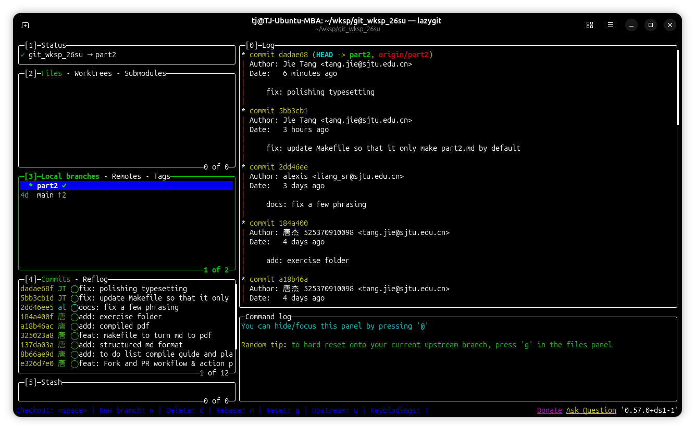
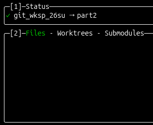
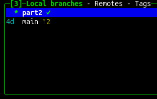
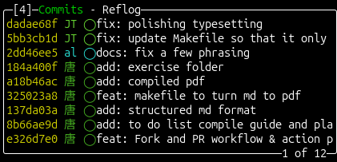
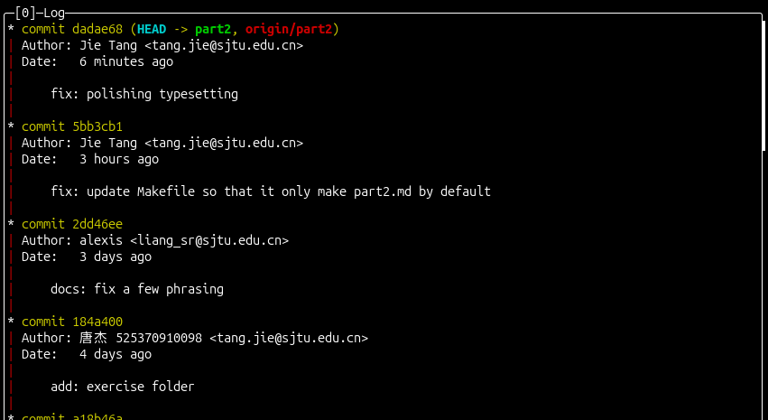
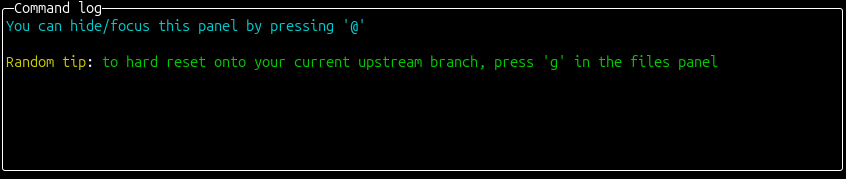
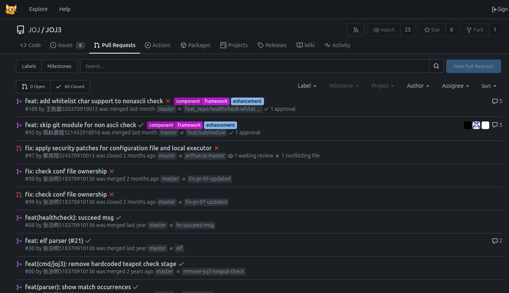
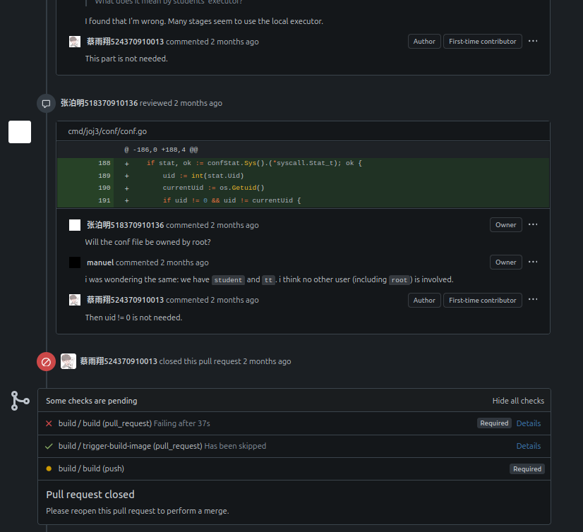
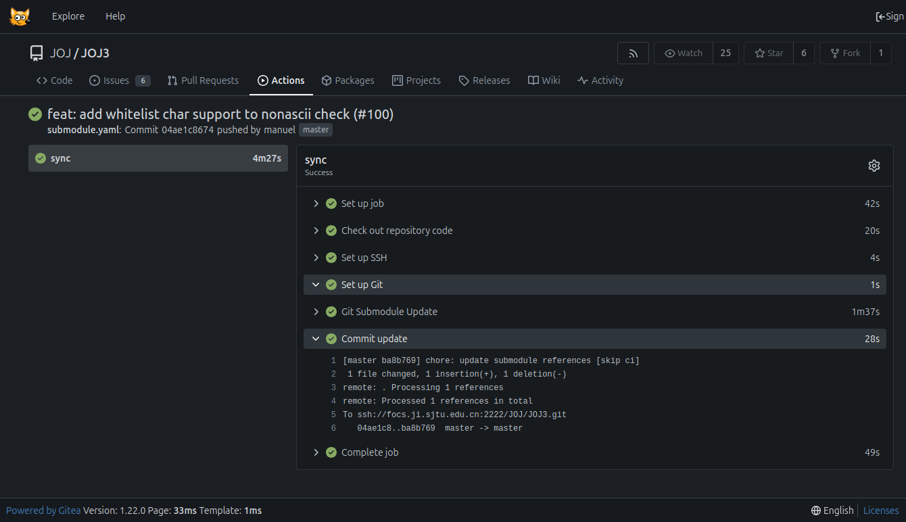

---
title:
  - Git Workshop Part 2
author:
  - Tech GC
theme:
  - Copenhagen
date:
  - May 2026
colorlinks: true
linkcolor: .
urlcolor: blue
header-includes: |
  \usepackage{fvextra}
  \usepackage{listings}
  \usepackage{geometry}
  \geometry{left=0.8cm,right=0.8cm,top=0cm,bottom=1.5cm,headheight=2.25ex,headsep=0pt}
  \setbeamertemplate{navigation symbols}{}
  \DefineVerbatimEnvironment{Highlighting}{Verbatim}{breaklines,breakanywhere,commandchars=\\\{\},fontsize=\scriptsize,leftmargin=0pt,rightmargin=0pt}
  \lstset{basicstyle=\ttfamily\scriptsize,frame=single,frameround=tttt,columns=fullflexible,keepspaces=true,backgroundcolor=\color{yellow!20},breaklines=true,breakatwhitespace=false,xleftmargin=2pt,xrightmargin=2pt,aboveskip=2pt,belowskip=2pt}
  \renewcommand{\baselinestretch}{0.95}
  \setbeamertemplate{headline}{\leavevmode\hbox{\begin{beamercolorbox}[wd=\paperwidth,ht=2.25ex,dp=1ex,center]{section in head/foot}\usebeamerfont{section in head/foot}\insertsectionhead\end{beamercolorbox}}\vskip0pt}
  \setbeamertemplate{footline}{\leavevmode\hbox{\begin{beamercolorbox}[wd=.333333\paperwidth,ht=2.25ex,dp=1ex,center]{author in head/foot}\usebeamerfont{author in head/foot}\insertshortauthor\end{beamercolorbox}\begin{beamercolorbox}[wd=.333333\paperwidth,ht=2.25ex,dp=1ex,center]{title in head/foot}\usebeamerfont{title in head/foot}\insertshorttitle\end{beamercolorbox}\begin{beamercolorbox}[wd=.333333\paperwidth,ht=2.25ex,dp=1ex,right]{date in head/foot}\usebeamerfont{date in head/foot}\insertshortdate{}\hspace*{2em}\insertframenumber{} / \inserttotalframenumber\hspace*{2ex}\end{beamercolorbox}}\vskip0pt}

---


\tableofcontents

# 1. Mental Model Review: Commits, Branches, and References

## Recap from Part 1

- **Commits**: Snapshots of repository state with hash id and parent links.
- **Branches**: Lightweight, movable pointers to specific commits.
- **`HEAD`**: Your current location indicator (where you are writing next).
- **Remote-tracking Branches**: Local references that mirror remote branch tips after fetch/pull (e.g., `origin/main`).

## Core Key Insight

:::center
**Branches do not contain commits. Branches point to commits, and commits point backward to their parents.**
:::

## Visualizing the Graph

```bash
git log --graph --oneline --decorate --all

```

**What this shows you:**

* Exact history topology and branch divergence.
* Current position of `HEAD` relative to local and remote tracking branches.

## Detached HEAD State

**The Concept:**
Checking out a specific commit instead of a branch detaches `HEAD` from any branch name.

```bash
git checkout abc1234
# HEAD now points directly to a commit
```

> **Warning:** New commits created here can become unreachable from normal branch names once you checkout another branch.

---

### Quick Recovery Options

The safest move is to give the detached state a name *before* you leave it:

```bash
# Save state immediately by creating a branch from where you are
git checkout -b new-branch-name

```

> **Tip:** We will come back to deeper recovery (e.g., when you have already switched away) in Section 6 "Git Reflog".

### A Tiny Example

```bash
git checkout abc1234        # HEAD detaches
# ... experimental commit X ...
git checkout -b try-x       # X is now safely on branch "try-x"
```

## Understanding References

### Reference Types

| Type | Example | Behavior |
| --- | --- | --- |
| **Branch** | `main`, `feature/login` | Moves forward dynamically with new commits |
| **Tag** | `v1.0.0`, `release-2.0` | Static snapshot marker; never moves |
| **Remote-tracking** | `origin/main` | Local mirror of remote state, updated by fetch/pull |
| **Special** | `HEAD`, `MERGE_HEAD` | Internal operational pointers |


---

### Useful Reference Shortcuts

* `HEAD~1` or `HEAD^` : Direct parent of current commit
* `HEAD~2` : Grandparent of current commit
* `main~3` : Three commits back from the tip of the main branch
* `origin/main@{yesterday}` : State of the tracking branch 24 hours ago

```text
G   H   I   J
 \ /     \ /
  D   E   F
   \  |  / \
    \ | /   |
     \|/    |
      B     C
       \   /
        \ /
         A
A =      = A^0
B = A^   = A^1     = A~1
C = A^2
D = A^^  = A^1^1   = A~2
E = B^2  = A^^2
F = B^3  = A^^3
G = A^^^ = A^1^1^1 = A~3
H = D^2  = B^^2    = A^^^2  = A~2^2
...

```

# 2. Merge Strategies and Team Integration

## How git merge Actually Works

Before talking about *strategies*, it helps to understand the **underlying algorithm**.

Almost every `git merge` is a **three-way merge**: Git finds the *merge base* (latest common ancestor of the two branches) and combines changes from both sides relative to that base.

```text
        A---B---C   (main)
         \
          D---E    (feature)

Merge base: A
"Left side"  changes : A -> C
"Right side" changes : A -> E
Three-way merge combines both onto the result.
```

> **Key idea:** Whether the result is a *fast-forward*, a *no-ff merge commit*, or a *squashed* single commit is a question of **how the result is recorded**, not which algorithm is used.

## Integration Choices Overview

### Fast-Forward Merge (`--ff`)

When the target branch has not moved since the source branch started, no actual three-way combination is needed. Git simply slides the branch pointer forward.

```text
Before: A---B---C (main)
                 \
                  D---E (feature)
After:  A---B---C---D---E (main, feature)

```

---

### No-Fast-Forward Merge (`--no-ff`)

Forces a real merge commit even when fast-forward is possible. The feature branch stays visible as a "bubble" in the graph.

```text
Before: A---B---C (main)
                 \
                  D---E (feature)
After:  A---B---C-------M (main)
                 \     /
                  D---E   (feature)
```

---

### Squash Merge (`--squash`)

Condenses all incoming changes into a single brand-new commit on the target branch. The feature branch history is *not* recorded on `main`.

```text
Before: A---B---C (main)
                 \
                  D---E---F (feature)
After:  A---B---C---G (main)        # G = D+E+F squashed

```

---

## Decision Strategy Matrix

| Strategy | Best Use Case | History Style | Extra Commit? |
| --- | --- | --- | --- |
| **Fast-Forward** (`--ff`) | Short-lived linear branches | Seamless line | No |
| **No-FF** (`--no-ff`) | Strict Feature/PR tracking | Grouped graph (bubble) | Yes (merge commit) |
| **Squash** (`--squash`) | Noisy local feature commits | Compact line | Yes (squashed commit) |
| **Rebase + Merge** | Want clean linear history but main moved | Seamless line | Optional |

> All four are powered by the same three-way merge engine — they only differ in **what kind of commit (if any) is produced**.

## Team Integration Workflows

### Approach A: Linear History Preference

Keep the main line strictly straightforward. Clean chronological reading.

```bash
git checkout feature-branch
git rebase main
git checkout main
git merge feature-branch  # Results in a clean Fast-Forward

```

### Approach B: Preserved Topology Preference

Explicitly show where work started, evolved, and was integrated.

```bash
git checkout main
git merge --no-ff feature-branch  # Guarantees a merge node

```

## Worked Example

Suppose `main` has commits `A-B-C` and your `feature` branch has `D-E` branched from `B`.

```bash
# Snapshot 1: fast-forward not possible (main has C after B)
$ git checkout main
$ git merge feature          # creates merge commit M
# Result: A-B-C-M, with feature D-E pointing into M

# Snapshot 2: with --squash
$ git merge --squash feature
$ git commit -m "feat: add feature X"
# Result: A-B-C-G (single squashed commit, feature branch unchanged)

# Snapshot 3: with rebase first, then merge
$ git checkout feature && git rebase main   # D,E -> D',E' on top of C
$ git checkout main && git merge feature    # fast-forward to E'
# Result: A-B-C-D'-E' (clean linear)
```

## Discussion Questions

* Which result is easiest to revert if the feature breaks production?
* Which result is easiest for a *new* reader of the project history?
* Which result hides the fact that a feature branch ever existed?


# 3. Rebase for Clean Feature Branches

## The Mechanics of Rebase

Rebase updates the starting parent commit of your branch, replaying your local changes sequentially on top of a new base commit.

```text
Before Rebase:
A---B---C  (main)
     \
      D---E  (feature)

After 'git rebase main':
A---B---C  (main)
         \
          D'---E'  (feature)

```

> **Note:** `D'` and `E'` contain identical code changes to `D` and `E`, but carry distinct hash signatures and unique parent identifiers.

## Rebase Execution Steps

```bash
# Step 1: Update your local tracking coordinates
git checkout main && git pull

# Step 2: Begin replay process
git checkout feature/my-feature
git rebase main

# Step 3: Handle individual files if conflicts occur, then proceed
git add conflict_resolved.txt
git rebase --continue

```

## Rebase Interruption Controls

* `git rebase --continue` : Continue replaying commits after a conflict resolution.
* `git rebase --skip` : Drop the current conflicting commit entirely.
* `git rebase --abort` : Instantly halt and return your branch to pre-rebase status.

## Why One Rebase Can Stop Multiple Times

Each replayed commit is applied **on top of the new base** in order. If commit `D` touches the same lines as recent main changes, you resolve once. If commit `E` *also* touches those lines, you resolve again. Each resolution is per-commit, not per-rebase.

```text
Rebase plan: D -> E onto C
[step 1/2] applying D ...        CONFLICT in src/api.ts
   ->  fix, git add, git rebase --continue
[step 2/2] applying E ...        CONFLICT in src/api.ts
   ->  fix, git add, git rebase --continue
Successfully rebased and updated refs/heads/feature.
```

## The Cardinal Rule of Rebase

:::center
**Never rebase commits that have already been pushed to a shared public repository.**
:::

If you must update a remote branch after rebasing your own feature work, protect teammates' unseen commits:

```bash
git push --force-with-lease  # Rejects push if remote has unseen changes

```

## Try It: Mini Rebase Drill

```bash
# Setup
git init demo && cd demo
echo "v1" > a.txt && git add . && git commit -m "init"
git checkout -b feature
echo "feature-line" >> a.txt && git commit -am "feat: add line"
git checkout main
echo "main-line"    >> a.txt && git commit -am "fix: hotfix"

# Now rebase feature onto main and resolve the conflict
git checkout feature
git rebase main
# Edit a.txt to keep both lines, then:
git add a.txt && git rebase --continue
git log --graph --oneline --all
```


# 4. Interactive Rebase: Editing Local History

## Complete Control Over Commits

Interactive rebase (`git rebase -i`) acts as a local history editor before pushing your updates up to code review.


```bash
# Open interactive configuration for the last 4 commits
git rebase -i HEAD~4

```

## Command Directives Reference

\begingroup
\scriptsize
\renewcommand{\arraystretch}{0.85}
\setlength{\tabcolsep}{4pt}
\arrayrulewidth=0.4pt
| Directive | Alias | Intended Outcome |
| --- | --- | --- |
| **`pick`** | `p` | Keep the commit exactly as it is |
| **`reword`** | `r` | Keep the code changes but rewrite the log message |
| **`edit`** | `e` | Stop at this commit to modify files or split it |
| **`squash`** | `s` | Combine changes into previous commit, merging messages |
| **`fixup`** | `f` | Combine changes into previous commit, discarding this message |
| **`drop`** | `d` | Erase this specific commit completely from history |
\endgroup

## Common History Edits

### Workflow 1: Squashing Noise

Turn multiple intermediate "work-in-progress" commits into a clean historical entry.

```text
# Todo list modification example
pick abc1234 Add login form structure
f    def5678 Fix layout typo
f    ghi9012 Add input verification rules

```
---

### Workflow 2: Splitting a Monolithic Commit

Break one large commit into small, atomic context pieces.

```bash
# 1. Mark 'edit' next to the targeted commit in the interactive menu
edit abc1234 Implement complete profile module

# 2. When Git pauses at the commit, step back one snapshot:
git reset HEAD~1

# 3. Component Stage and Commit separately
git add component_a.js && git commit -m "Profile Part 1: Logic"
git add component_b.js && git commit -m "Profile Part 2: Interface"

# 4. Resume the rebase chain
git rebase --continue
```

---

### Workflow 3: Reordering Commits

Sometimes the *story* of the branch matters: tests first, then implementation. Just rearrange the lines in the todo editor.

```text
# Before                            # After (just reorder pick lines)
pick a1 feat: add login impl        pick c3 test: add login tests
pick b2 fix: small typo             pick a1 feat: add login impl
pick c3 test: add login tests       pick b2 fix: small typo
```

> If a reorder produces a conflict, treat it like a normal rebase conflict: resolve, `git add`, `git rebase --continue`.

## Try It: Clean a Messy Branch

```bash
# Setup a messy branch
git init demo-irebase && cd demo-irebase
echo "v1" > app.txt && git add . && git commit -m "init"
echo "feat" >> app.txt && git commit -am "Add featurex"     # bad msg
echo "fix" >> app.txt && git commit -am "WIP"                # bad msg
echo "fix" >> app.txt && git commit -am "fixup typo"         # noise

# Now clean it up in one rebase
git rebase -i HEAD~3
#   reword Add featurex        -> "feat: add feature X"
#   reword WIP                 -> "feat: continue feature X"
#   fixup  fixup typo
```

## Safety Notes

* Interactive rebase **rewrites commit IDs**. Use it freely on private local work.
* Be careful after pushing — coordinate with teammates or use `--force-with-lease`.
* If something goes wrong, `git reflog` is your safety net (Section 6).


# 5. Cherry-Pick: Moving Selected Commits

## Targeting Specific Commits

Cherry-pick isolates single commits from other timelines and applies them directly on top of your current branch. The applied commit gets a **new hash** (different parent), so the original is *copied*, not moved.

```text
Before:
A---B---C (main, HEAD)
     \
      D---E---F (feature)

After 'git cherry-pick E':
A---B---C---E' (main, HEAD)
     \
      D---E---F  (feature, unchanged)
```

:::center
**"I need this precise fix, without merging that entire unfinished branch."**
:::

```bash
# Extract a singular change onto your active branch
git cherry-pick abc1234

```

## Practical Application Scenarios

* **Hotfixing**: Pulling a security fix directly from an ongoing testing branch into production.
* **Backporting**: Moving bug fixes from current development releases to legacy support branches.
* **Recovery**: Salvaging valid logic structures from a feature track that was abandoned.

## Range and Automation Flags

```bash
# Single commit
git cherry-pick abc1234

# Inclusive range (oldest^..newest, both ends included)
git cherry-pick abc1234^..def5678

# Replay all commits reachable from master but not from HEAD
git cherry-pick ^HEAD master

# Stage changes without committing — lets you edit before commit
git cherry-pick -n abc1234

# Conflict controls
git cherry-pick --continue
git cherry-pick --abort
git cherry-pick --skip
```

## Worked Example: Backporting a Bug Fix

```bash
# main has moved on; v1.x is a long-lived release branch
$ git log --oneline main -3
e1f2a3b fix: null pointer in parser          <-- we want this on v1.x
a7c8d9e feat: rewrite parser engine
b3c4d5e feat: new config format

$ git checkout v1.x
$ git cherry-pick e1f2a3b
# If parser.c diverged a lot, you may hit conflicts:
#   fix the file, then:
$ git add parser.c
$ git cherry-pick --continue
```

> **Gotcha:** Repeated cherry-picks of the same change across long-lived branches can create *duplicate-looking* commits with different hashes. When you eventually merge, Git usually handles it — but reviewers may be confused. Reference the original commit hash in the message to leave a trail.


# 6. Git Reflog: Recovery and Repair

## The Local Safety Net

Reflog tracks every single movement of `HEAD` and branch updates across your local development space.

:::center
**If a commit was created locally within the past 90 days, Reflog can find and restore it.**
:::

## Key Mechanics

* Reflog is entirely local; it never travels via `git push` or `git clone`.
* Entries expire after configurable time limits; common defaults are 90 days for reachable entries and 30 days for unreachable ones.

## Essential Diagnostics

```bash
# View complete sequential history of HEAD shifts
git reflog

# Sample Output Format:
# abc1234 HEAD@{0}: reset: moving to HEAD~2
# def5678 HEAD@{1}: commit: Add database drivers

```

## Emergency Recovery Solutions

### Scenario A: Accidental Hard Reset Recovery

```bash
# Recover from an accidental destructive command like: 
    git reset --hard HEAD~3
    git reflog
# Identify pre-reset snapshot state hash (e.g., HEAD@{1})
    git reset --hard HEAD@{1}

```

### Scenario B: Restoring an Accidentally Deleted Branch

```bash
git reflog
# Locate the last active commit hash belonging to the deleted branch
git branch feature-restored HEAD@{2}

```

---

### Scenario C: Undoing a Bad Rebase

```bash
# You just rebased, and the result is wrong.
git reflog
#   abc1234 HEAD@{0}: rebase finished: returning to refs/heads/feature
#   def5678 HEAD@{1}: rebase: pick "feat: add login"
#   ...
#   1a2b3c4 HEAD@{5}: checkout: moving from main to feature   <-- pre-rebase state
git reset --hard HEAD@{5}
```

### Scenario D: Recovering an Amended-Away Commit

```bash
git commit --amend -m "oops, lost the original message"
# Original commit is unreachable but still in reflog
git reflog show HEAD
# 9f8e7d6 HEAD@{1}: commit: original useful message
git show 9f8e7d6                      # inspect
git cherry-pick 9f8e7d6               # bring it back
```

## Safety Rule of Thumb

:::center
**When unsure, create a rescue branch FIRST. Branches are free; lost commits are not.**
:::

```bash
git switch -c rescue HEAD@{1}   # snapshot the suspicious state to a branch
# now you can experiment without fear
```


# 7. Stash, Worktrees, and Partial Staging

## Git Stash: Temporary Workspace Suspension

Save incomplete modifications without generating messy commits when context switching.

```bash
# Stash tracked modifications
git stash

# Stash including new, untracked workspace files
git stash -u

# Describe your stashed changes clearly
git stash push -m "In-progress API refactor"

# Restore the most recent stash (and drop it from the stack)
git stash pop

# Apply without dropping
git stash apply stash@{1}

# Review all saved stash layers
git stash list

# Drop a specific stash entry
git stash drop stash@{0}
```

## Real-World Scenario: The Surprise Hotfix

```bash
# Working on a half-finished feature when an urgent bug report lands
$ git status
On branch feature/profile
Changes not staged for commit:
  modified:   src/profile.tsx
  modified:   src/api/user.ts

$ git stash push -m "WIP: profile UI redesign"
Saved working directory and index state On feature/profile: WIP: profile UI redesign

# Switch, fix, ship
$ git switch main && git switch -c hotfix/login-crash
# ... fix, commit, PR ...

# Back to feature
$ git switch feature/profile
$ git stash pop                       # restores the modifications
```

## Git Worktree: Multi-Branch Environments

Check out multiple branches of the same repository simultaneously in separate directories. Unlike `stash`, your files stay where they are — you just open a *second* working directory pointing at a different branch.

:::center
**Review a PR or execute a hotfix without interrupting or clearing your active workspace.**
:::

```bash
# Mount a separate branch into a sibling directory
git worktree add ../project-hotfix hotfix/api-bug

# See all active worktrees
git worktree list

# Safely tear down directory after finishing the fix
git worktree remove ../project-hotfix
```

---

## Stash vs Worktree: When to Use Which?

| Use stash when... | Use worktree when... |
| --- | --- |
| Interruption is short (minutes) | Interruption is long (hours/days) |
| You just need to switch branch and come back | You need to *run* both branches side-by-side (e.g., diff servers) |
| Single working tree is enough | You want IDE windows open on two branches |

## Partial Staging (Patch Mode)

Interactively break down changes within a single modified file into distinct commits — invaluable when one editing session accidentally mixed two unrelated fixes.

```bash
git add -p  # Evaluates code block hunks sequentially
```

### Quick Response Map

* `y` : Stage this code hunk.
* `n` : Skip staging this code hunk.
* `s` : Split the current hunk into even smaller evaluation pieces.
* `e` : Manually edit the hunk before staging.
* `q` : Exit immediately; preserve current staging configuration.

---

### Example Flow

```text
$ git diff src/utils.ts
@@ -10,3 +10,8 @@ function formatDate(d) { ... }
+function formatTime(t) { ... }          <-- belongs to "feat: time"
@@ -34,1 +39,2 @@
-  return null;
+  return undefined;                       <-- belongs to "fix: nullish"

$ git add -p src/utils.ts
Stage this hunk [y,n,q,a,d,s,e,?]? y     # stage formatTime
Stage this hunk [y,n,q,a,d,s,e,?]? n     # skip nullish fix
$ git commit -m "feat: add formatTime helper"
$ git add -p src/utils.ts
Stage this hunk [y,n,q,a,d,s,e,?]? y
$ git commit -m "fix: return undefined instead of null"
```


# 8. Lazygit: Visual Terminal Workflow

## Terminal Interface for Git

Lazygit is a highly responsive keyboard-driven terminal UI that maps complex graph configurations onto clear layouts.

:::center
**Maintains structural clarity without hiding underlying Git CLI mechanics.**
:::

```bash
# Launch the interface directly in your repository folder
lazygit

```

---

{width=0.9\textwidth}


## Primary Interface Sections

The interface is split into a **side panel stack** (left) and a **main viewport** (right). Each side panel maps to a numbered shortcut (`1`–`5`).

1. **`[1]` Status**: current repo & branch, ahead/behind indicators.
2. **`[2]` Files**: working tree, staged/unstaged diffs, conflicts.
3. **`[3]` Local branches**: switch, merge, rebase, fast-forward.
4. **`[4]` Commits / Reflog**: graph history & undo timeline.
5. **`[5]` Stash**: stash list with apply / pop / drop.

---

## Side Panel

The upper side panel gives an overview of the current repository state, including the active branch, its status, and any pending changes.

{width=0.25\textwidth}

---

## Branches Panel

Press `3` to focus this panel.

{width=0.4\textwidth}

---

## Branch Operations Cheat Sheet

| Key | Action |
| --- | --- |
| `space` | Checkout the highlighted branch |
| `n` | Create a new branch from current |
| `M` | Merge into current branch |
| `r` | Rebase current branch onto highlighted |
| `d` | Delete branch |
| `f` | Fast-forward without checkout |

---

## Commits Panel & Interactive Rebase

Press `4` to enter the commits panel. This is where lazygit shines for **rewriting history**.

{width=0.55\textwidth}

---

## Commits Panel Operations Cheat Sheet

| Key | Action |
| --- | --- |
| `space` | Checkout commit (detached HEAD) |
| `e` / `r` | `edit` / `reword` this commit (interactive rebase) |
| `s` / `f` | `squash` / `fixup` into the commit below |
| `d` | `drop` this commit |
| `p` | `pick` (revert a drop) |
| `c` | Cherry-pick selected commit(s) |
| `g` | Reset (soft/mixed/hard) to commit |
| `Ctrl+j` / `Ctrl+k` | Move commit down / up (reorder) |

> Lazygit performs every action as a real Git command — press `@` to toggle the **command log** and watch the underlying `git rebase --interactive ...` invocation.

---

## Diff / Log Main Viewport

The right pane reflects whatever the active side panel selected — useful for reading commits, diffs, or staging hunks line-by-line.

{width=0.9\textwidth}

---

When the **Files** panel is focused, `space` here stages an individual file, hunk, or even a single line. Press `Enter` on a modified file to drop into hunk-level review:

```text
        [Files panel]               [Diff viewport]
   M  src/api/auth.ts        |  @@ -42,7 +42,7 @@
   ?? notes.todo             |  -    return token;
                             |  +    return signedToken;
                             |       }
```

---

## Command Log: The Educational Window

Press `@` (or look at the bottom panel) to see exactly what Git command lazygit just ran.

{width=0.9\textwidth}

> **Why this matters**: lazygit is a *teacher*, not just a tool. Every shortcut maps to a real `git ...` invocation — read along to internalize the CLI.

---

## Common Operations Cheat Sheet

| Workflow | Lazygit Keys | Underlying Git |
| --- | --- | --- |
| Stage all & commit | Files → `a`, then `c` | `git add . && git commit` |
| Amend last commit | Files → `A` | `git commit --amend --no-edit` |
| Squash commits | Commits → `s` × N | `git rebase -i HEAD~N` |
| Cherry-pick range | Commits → `Shift+c` then `Shift+v` on target | `git cherry-pick A^..B` |
| Resolve conflict | Files → `Enter` on conflicted file | manual edit + `git add` |
| Force-with-lease push | Branches → `P` then confirm | `git push --force-with-lease` |
| Recover from oops | `4` → tab to **Reflog** → `space` | `git reset --hard HEAD@{n}` |

## Navigation Basics

* `k` / `j` or arrows : Move up and down within active panels.
* `H` / `L` or `Tab` : Cycle between panels.
* `Space` : Toggle staging for a file / hunk / single line.
* `c` : Open the commit message editor.
* `@` : Toggle the command log window.
* `z` : Undo last operation (`git reset` to a reflog entry).
* `?` : Open the contextual help for the current panel.
* `Esc` or `q` : Step back / exit the interface.


# 9. Remote Collaboration Policies

## Keeping Remotes Organized

### Fetch vs Pull Optimization

```bash
# Fetch: Downloads remote updates without modifying local working tracks
git fetch origin

# Pull: Combines fetch with merge or rebase, depending on configuration
git pull

# Clean Pull: Replays your local commits cleanly on top of incoming changes
git pull --rebase
```

> `git pull` = `git fetch` + `git merge` (default) or `git rebase` (with `--rebase`).
> Fetch first when you want to *inspect* before integrating.

## Tracking Verification

```bash
# Match local branches with remote destinations explicitly
git push -u origin feature/auth

# Inspect tracking health and divergence distances
git branch -vv
```


```text
Sample Output:
* main         abc1234 [origin/main] Fix memory leak
  feature/auth def5678 [origin/feature/auth: ahead 1, behind 2] Update tokens
```

* `ahead N` : you have N commits the remote does not.
* `behind N`: the remote has N commits you do not.
* Both ahead **and** behind : the branch has *diverged* — a plain `git pull` will produce a merge commit unless you `--rebase`.

## Core Safety Controls

* Avoid raw `git push --force`. Always protect your upstream target lines by using `git push --force-with-lease`.
* **Prohibited Action**: Never execute history rewrites or force-pushes on long-lived default branches (e.g., `main`, `master`, `develop`).
* Configure branch **protection rules** on the server (require PRs, status checks, signed commits) so policy is enforced, not just remembered.

## Team Policy Checklist

* [x] Protected `main` / `master` / `dev` (no direct push).
* [x] All work on feature branches; PRs required.
* [x] Local noisy commits rebased or squashed *before* review.
* [x] `--force-with-lease`, never plain `--force` on shared remotes.
* [x] Ask before rewriting any branch a teammate is using.


# 10. Fork and Pull Request Workflow

## Shared Source Management

A **Fork** is an independent, server-side copy of a repository hosted under your personal namespace.

### Repository Ecosystem Map

```text
+---------------------------------------+
| Upstream Repository (Central/Original) |
+---------------------------------------+
                   ^
                   | Pull Request Submissions
                   |
+---------------------------------------+
| Origin Repository (Your Remote Fork)  |
+---------------------------------------+
                   ^
                   | Push / Pull Syncing
                   |
+---------------------------------------+
| Local Workspace (Your Computer)      |
+---------------------------------------+

```

---

{width=0.8\textwidth}


## Step-by-Step Fork Deployment

```bash
# Step 1: Clone your personal fork
git clone https://github.com/YOUR_USERNAME/repository.git

# Step 2: Establish connection to the original project
git remote add upstream https://github.com/ORIGINAL_OWNER/repository.git

# Step 3: Synchronize with upstream changes before starting new work
git checkout main
git fetch upstream
git rebase upstream/main
git push origin main

# Step 4: Work on your isolated feature track
git checkout -b feature/contribution

# Step 5: Push and open a PR on the upstream repository
git push -u origin feature/contribution
# Then click "Compare & pull request" on GitHub
```

## Keeping the Fork Healthy

```bash
# Periodically sync main with upstream so your PRs branch from the latest base
git fetch upstream
git checkout main
git merge --ff-only upstream/main   # fail loudly if main diverged
git push origin main
```

> **Tip:** Always branch new feature work from a *freshly synced* `main`. Diverged forks lead to messy PR diffs.

---

{width=0.9\textwidth}


# 11. GitHub Actions: Automation Basics

## Declarative Workflow Pipelines

GitHub Actions listen for repository events (e.g., pushes, pull requests) to automatically trigger builds, test suites, and deployments.

| Core Concept | Functional Definition |
| --- | --- |
| **Workflow** | Automation blueprint script located within `.github/workflows/*.yml` |
| **Event** | The explicit trigger condition (e.g., `push`, `pull_request`) |
| **Job** | A sequence of steps executed on a clean virtual machine runner |
| **Step** | Individual tasks that execute console scripts or predefined actions |

## Standard Continuous Integration Configuration

```yaml
name: Project Verification Pipeline

on:
  push:
    branches: [main]
  pull_request:
    branches: [main]

jobs:
  test-suite:
    runs-on: ubuntu-latest
    steps:
      - name: Import Codebase Source
        uses: actions/checkout@v4

      - name: Initialize Runtime Environment
        uses: actions/setup-node@v4
        with:
          node-version: '20'

      - name: Execute Standard Testing
        run: |
          npm ci
          npm test
```

---

{width=0.85\textwidth}


## Production Workflow Best Practices

* **Explicit Pinning**: Use major tags for convenience (e.g., `actions/checkout@v4`) or full commit SHAs when you need stronger supply-chain control.
* **Concurrency Controls**: Cancel older runs automatically when a developer pushes new updates to an active pull request:

```yaml
concurrency:
  group: ${{ github.workflow }}-${{ github.ref }}
  cancel-in-progress: true

```


# 12. Capstone Exercise: Clean Up a Messy Team Repository

## The Scenario

Your team is preparing a release. The development branches are cluttered with repetitive, unverified commits, someone accidentally ran an incorrect rebase, and a vital hotfix is stuck on a abandoned branch. Your objective is to clean up this repository structure.

## Practical Execution Tasks

1. Run the `git log --graph --oneline --decorate --all` command to map out all branch locations.
2. Locate and recover a lost commit using `git reflog`.
3. Rebase your target feature branch onto the latest `main` branch state.
4. Manually resolve the resulting rebase conflicts, then resume using `--continue`.
5. Run an interactive rebase (`git rebase -i`) to squash small commits and clean up your log messages.
6. Use `git cherry-pick` to bring over the isolated hotfix from the abandoned branch.
7. Merge the polished feature branch into `main` using your team's integration strategy.
8. Verify the final graph state and staging layout inside `lazygit`.
9. Safely push the completed history up to the remote server using `--force-with-lease`.

---

\center

\huge

**Thank you!**
